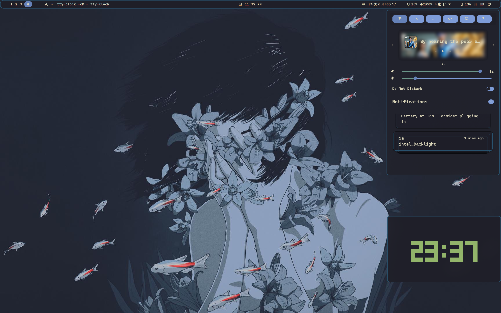
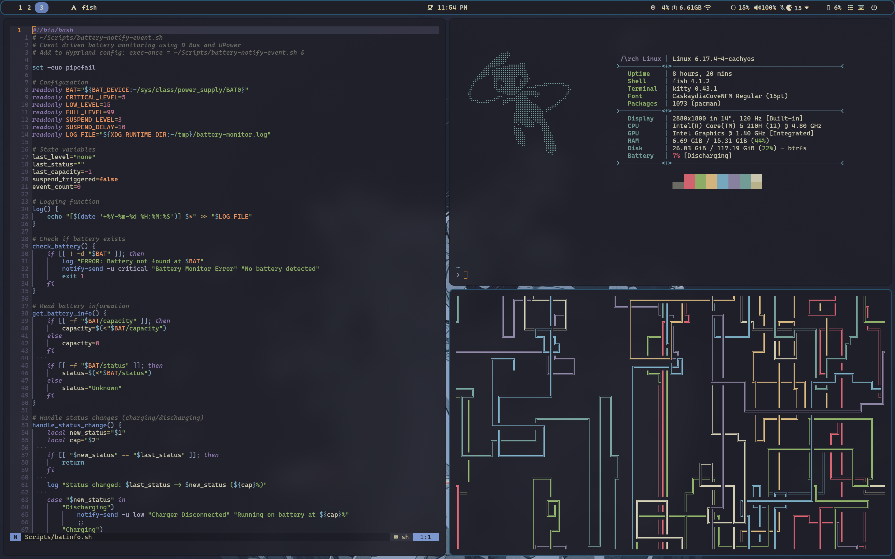
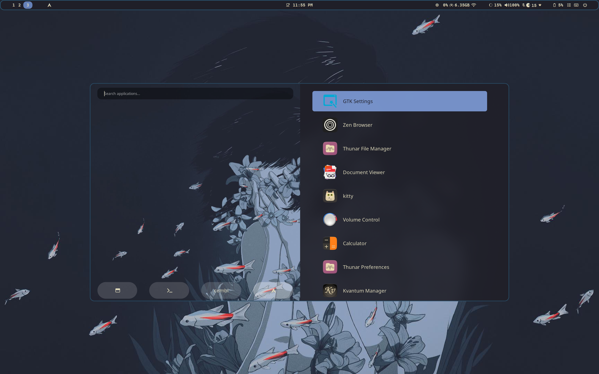

# 🌸 Dotfiles Setup

A modular, theme-aware dotfiles setup for Linux.
It includes automatic color theming, wallpaper management, and cross-application consistency across Hyprland, GTK, Rofi, Kitty, Swaync and Neovim.

## ✅ Prerequisites

This setup uses `GNU stow` to manage dotfiles. Make sure you have it installed.
It can be installed via you pacakage manager so 
```
#on Arch
sudo pacman -S stow
```

The scripts control the themes of the following applications:

| Application | Description                                         |
|-------------|-----------------------------------------------------|
| `Hyprland`  | Tiling Wayland compositor                           |
| `Rofi`      | Window switcher and application launcher            |
| `Kitty`     | Terminal                                            |
| `Waybar`    | Top bar                                             |
| `SwayNC`    | Notification daemon                                 |
| `Neovim`    | Editor                                              |
| `Wlogout`   | Logout menu                                         |
| `Hyprlock`  | Lock screen                                         |

 The script currently changes gtk themes as well.
 I don't use any qt application so no qt support.

---

## ⚙️ Installation


- This setup assumes all required software (Hyprland, Kitty, Waybar, Rofi, etc.) are already installed.
- Existing configuration files in `~/.config` will be backed up with `_bak` suffix before being replaced.


```bash
# Clone the repository
git clone https://github.com/krishna4a6av/.config.git ~/.dotfiles
cd ~/.dotfiles

# Run the setup script
./setup.sh
```


### 🖼️ Screenshots

<details>

<summary> Everforest</summary>
<table>
  <tr>
    <td></td>
  </tr>
</table></details>

<details>
<summary> Gruvbox</summary>
<table>
  <tr>
    <td></td>
    <td></td>
    <td></td>
  </tr>
  <tr>
    <td></td>
    <td></td>
  </tr>
</table></details>

<details>
<summary> Kanagawa</summary>
<table>
  <tr>
    <td></td>
    <td></td>
    <td></td>
  </tr>
</table></details>

</details>

## 🧩 How it Works

<details>
<summary>🎨 The Color & Theme System</summary>

### 1. Themer Scripts

The `~/.config/colors/Themer/` directory contains scripts to manage and apply themes.

#### `theme.sh`
This is the main script that ties everything together. It uses Rofi to present a menu of available themes (based on the subdirectories in `~/Pictures/Wallpapers`). Once a theme is selected, it calls the other scripts (`Colors.sh`, `Nvim-Theme-Switcher.sh`, `Setgtk.sh`, and `Wallpaper.sh`) to apply the theme across the system.

#### `Colors.sh`
This script manages the color schemes for various applications. It takes a theme name as an argument and creates symbolic links from the corresponding theme files in `~/.config/colors/` to the configuration files for Rofi, Hyprland, and Kitty. It then reloads Waybar and SwayNC to apply the new colors.

#### `Wallpaper.sh`
This script handles changing the desktop wallpaper. It can be run with a theme name to select a wallpaper from that theme's folder. It uses Rofi to display a wallpaper selection menu with thumbnails, which it generates and caches on the fly. Once a wallpaper is selected, it's set using `swww`.

#### `Setgtk.sh`
This script is responsible for setting the GTK (Gnome Toolkit) theme, which affects the appearance of many graphical applications. It maps a simple theme name (like "gruvbox") to a full GTK theme name (like "Gruvbox-Dark") and applies it using `gsettings` and by updating GTK configuration files. It also restarts desktop portals to ensure the changes are applied to Flatpak and other sandboxed applications.
    The gtk themes are in /themes folder and are handled by setup sctipt.

### 2. `~/.config/colors/`

This directory contains all your theme color files in multiple formats for different tools.

</details>

--Note: Add wallpapers in ~/Pictures/Wallpapers/ in specified theme file, for the wallpaper script to work
my wallpapers: https://github.com/krishna4a6av/Wallpapers.git
