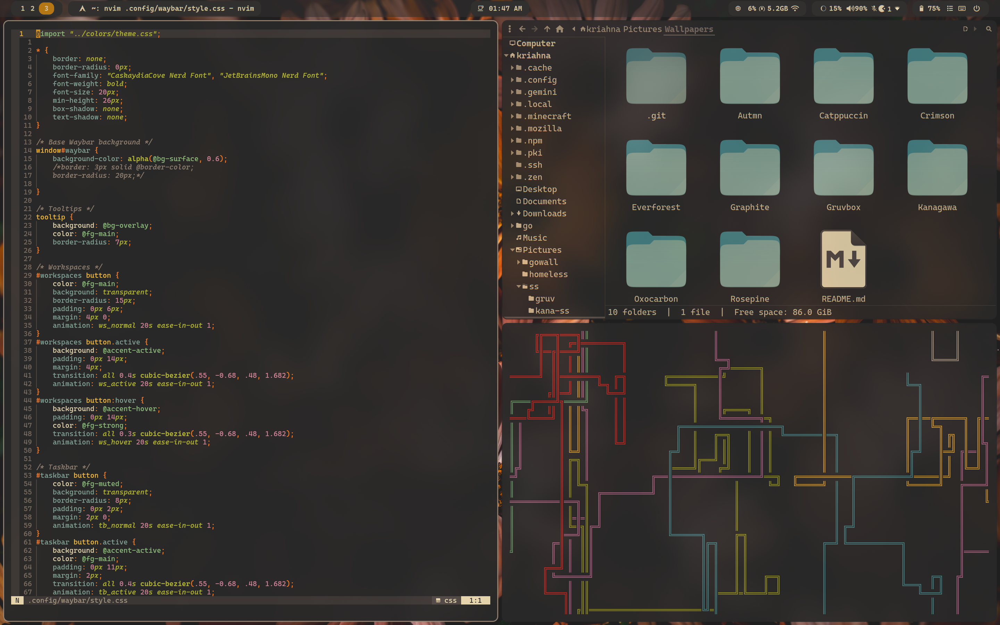
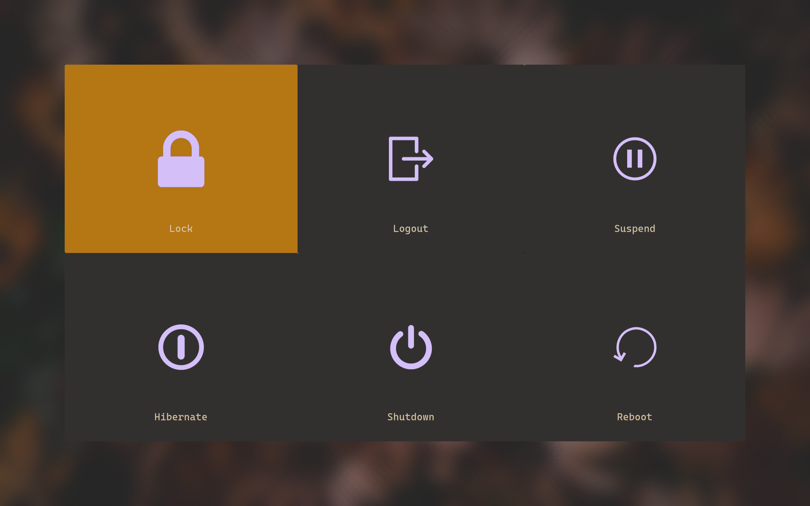
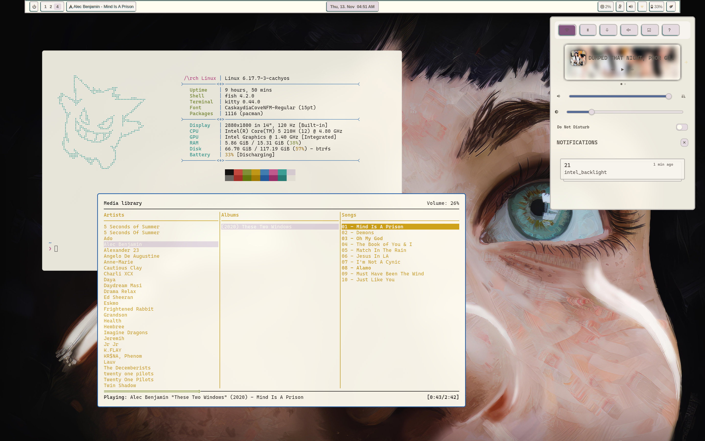
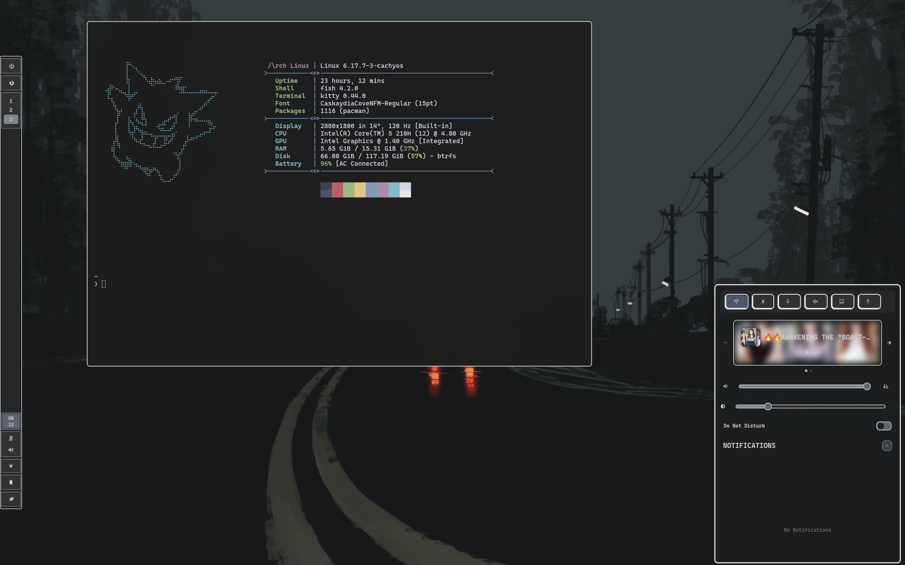
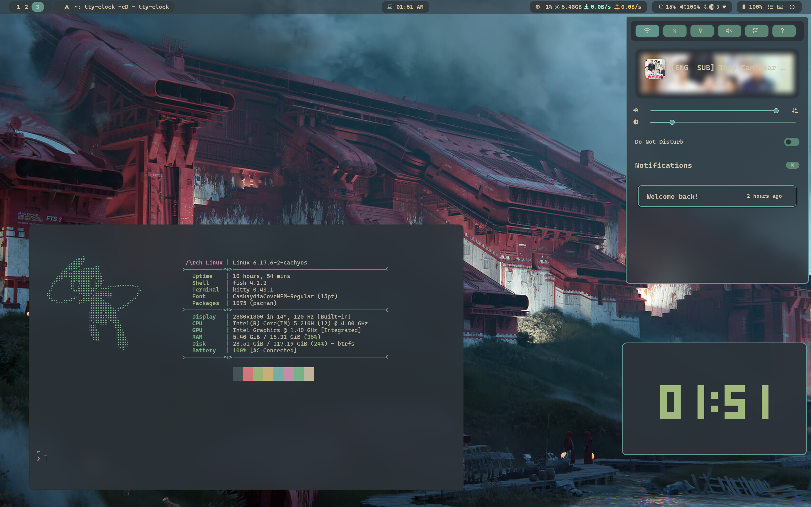
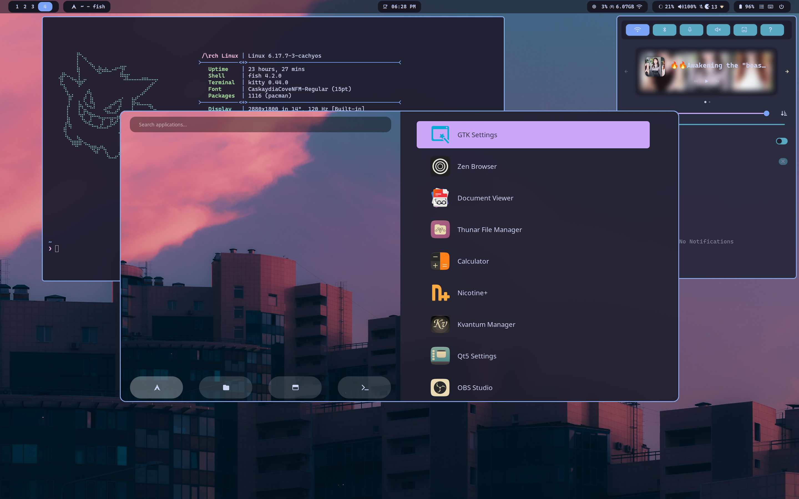

# 🌸 Dotfiles Setup

A modular, theme-aware dotfiles setup for Linux.
It includes automatic color theming, wallpaper management, and cross-application consistency across Hyprland, GTK, Rofi, Kitty, Swaync and Neovim.

* I am using a 14" laptop so the sizing of elements will likely be too big for most other screens and will need manual configuration.
      I have used em values in waybar, swaync, wlogout so adjusting the main size in there layout and the adjusting the font value(in px) should adjust all the ui elements accordingly.(If they are too big for you)

## Prerequisites

- The setup script uses `GNU stow` to manage dotfiles. Make sure you have it installed.
It can be installed via your pacakage manager so,

```
# On Arch
sudo pacman -S stow
```

- The scripts uses and controlsthe themes of the following applications:

| Application | Description                                         |
|-------------|-----------------------------------------------------|
| `Hyprland`  | Tiling Wayland compositor                           |
| `swww`      | Wallpaper manager                                   |
| `Rofi`      | Window switcher and application launcher            |
| `Kitty`     | Terminal                                            |
| `Waybar`    | Top bar                                             |
| `SwayNC`    | Notification daemon                                 |
| `Wlogout`   | Logout menu                                         |
| `Hyprlock`  | Lock screen                                         |
| `Neovim`    | Editor                                              |

 The script currently changes gtk themes as well hard generated as well as matugen.
 I don't use any qt application so no qt support, matugen works with it though.

- To use matugen colors you need to install it from your distros's package manager as well.

---

## ⚙️ Installation


- The setup script assumes all required software (Hyprland, Kitty, Waybar, Rofi, etc.) are already installed, and do not install anything.
- Existing configuration files in `~/.config/file` will be backed up with `_bak` suffix before being replaced(so file_bak).
- The config file are symlinked with stow. So they can be easily managed and modified. I recommend going through setup.sh before running it.


```bash
# Clone the repository
git clone https://github.com/krishna4a6av/.config.git ~/.dotfiles
cd ~/.dotfiles

# Run the setup script
./setup.sh
```

# Important stuff

* Display setting is set at 2880x1800 in 14", 120 Hz for me you can adjust it in .config/hypr/config/monitors.conf.
* The wallpaper script uses swww by default, You can adjust the wallpaper manager in /config/colors/Themer/Wallpapers.sh. Alternative you can also adjust the file to look for walpaper in the script.
* Add wallpapers in ~/Pictures/Wallpapers/ in specified theme file, for the wallpaper script to work. (My wallpapers: https://github.com/krishna4a6av/Wallpapers.git)
* You can see the all keybinds with "SUPER + /"


### 🖼️ Screenshots

<details>
  <summary> Gruvbox</summary>
  <table>
    <tr>
      <td></td>
      <td></td>
      <td></td>
    </tr>
    <tr>
      <td></td>
      <td></td>
    </tr>
  </table>
</details>

<details>
  <summary> Flexoki</summary>
  
</details>

<details>
  <summary> Graphite</summary>
  
</details>

<details>
  <summary> Everforest</summary>
  
</details>


<details>
  <summary> Autmn</summary>
  
</details>

<details>
  <summary> Kanagawa</summary>
  
</details>

<details>
  <summary> Catppuccin</summary>
  
</details>


Will add rest of the ss later... someday.


## How it Works

<details>
<summary> The Color & Theme System</summary>

  ### 1. Themer Scripts
  
  The `~/.config/colors/Themer/` directory contains scripts to manage and apply themes.
  
  #### `theme.sh`
  This is the main script that ties everything together. It uses Rofi to present a menu of available themes (based on the subdirectories in `~/Pictures/Wallpapers`). Once a theme is selected, it calls the other scripts (`Colors.sh`, `Nvim-Theme-Switcher.sh`, `Setgtk.sh`, and `Wallpaper.sh`) to apply the theme across the system.
  
  #### `Colors.sh`
  This script manages the color schemes for various applications. It takes a theme name as an argument and creates symbolic links from the corresponding theme files in `~/.config/colors/` to the configuration files for Rofi, Hyprland, and Kitty. It then reloads Waybar and SwayNC to apply the new colors.
  
  #### `Wallpaper.sh`
  This script handles changing the desktop wallpaper. It can be run with a theme name to select a wallpaper from that theme's folder. It uses Rofi to display a wallpaper selection menu with thumbnails, which it generates and caches on the fly. Once a wallpaper is selected, it's set using `swww`.
  
  #### `Setgtk.sh`
  This script is responsible for setting the GTK (Gnome Toolkit) theme, which affects the appearance of many graphical applications. It maps a simple theme name (like "gruvbox") to a full GTK theme name (like "Gruvbox-Dark") and applies it using `gsettings` and by updating GTK configuration files. It also restarts desktop portals to ensure the changes are applied to Flatpak and other sandboxed applications.
      The gtk themes are in /themes folder and are handled by setup sctipt.
  
  ### 2. `~/.config/colors/`
  
  - This directory contains all your theme color files in multiple formats for different packages.
  - And symlink of these configs manges theme of these packages, through the scripts above.

</details>


<details>
<summary>Neovim theming</summary>

  - Uses an associative array mapping readable theme names → their actual Neovim colorscheme names. 
  - When a theme is chosed its correstponding colorscheme is stored in a file current_theme.txt
  - And in nvim config file the colorscheme is set to be read from this current_theme file, thus changeing the themename in current_theme.txt allows us to change the theme.
  
</details>


